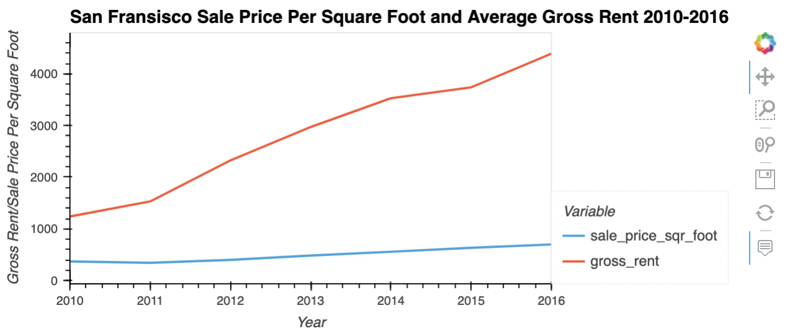
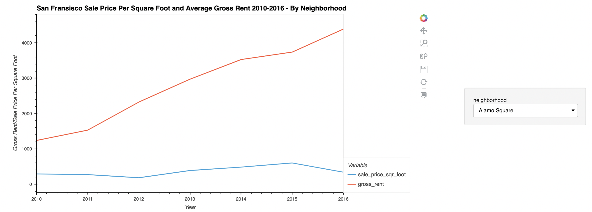
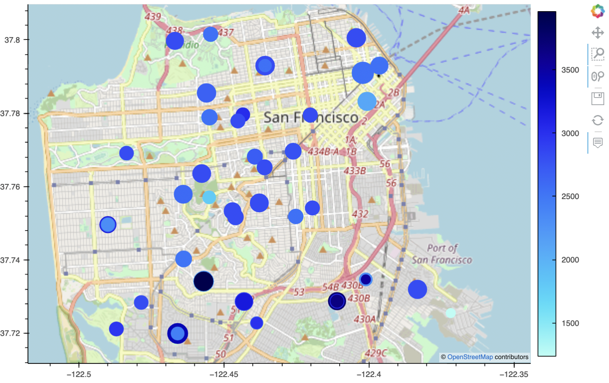

# 06_Rental_Market_SF

### This project aims to determine if an one-click service for consumers to buy properties and rent is feasible. This is done by analyzing the historical 6-year rent and cost per square foot prices of San Francisco neighborhoods and plotting the data to make an interactive map to help with decision making.

---

## Technologies

This project leverages python 3.9 and Jupyter lab notebook was used to run all analysis.

---

## Installation Guide

Before running the application first import the following libraries and dependencies.

```python
import pandas as pd
import hvplot.pandas
from pathlib import Path
```

---

## Housing Units per Year

After reading into the `sfo_neighborhoods_census_data` CSV file, the `sfo_data` dataframe was created in order to visualize the trends of the housing units per year.

The `groupby()` function was used and each year's mean was plotted. As you can see, the housing units have been increasing steadly in the timeframe of 2010-2016.


---

## Analyzing and Visualizing Gross Rent and Sale Price per Square Foot

From the original `sfo_data` dataframe, the `prices_square_foot_by_year` was created, which only included the year, averages of each year's sale price per square foot, and gross rent. This helped to visualize any trends that we may observe.

From the graph, it is clear that the rent has continued to grow from 2010-2016. However, in 2011, the average sale price per square foot dropped to $341.90. The gross rent was not affected and still increased to $1530.



---

## Analyzing and Visualizing Gross Rent and Sale Price per Square Foot by Neighborhood

To make this visualization more interactive, the graph was updated so clients can filter the data by neighborhood. The dataframe `prices_by_year_by_neighborhood` was created, which only included the sale price per square foot and gross rent filtered by year and neighborhood.

When plotting the visualization, the function `groupby` was used and applied:

```python
prices_by_year_by_neighborhood.hvplot.line(
    x='year',
    xlabel ='Year',
    ylabel ='Gross Rent/Sale Price Per Square Foot',
    groupby ='neighborhood',
    title = 'San Fransisco Sale Price Per Square Foot and Average Gross Rent 2010-2016 - By Neighborhood',
    width=1000,
    height=500
)
```

The dropdown menu allows clients to look at data of different neighborhoods.



---

## Interactive Map

Using the original data set and another dataset combined, a new dataset, `all_neighborhoods_df` was created where it includes the neighborhoods' longtitudes and lattitudes. This allowed for the making of an interactive map using the following codes to visualize the housing trends of SF in 2010-2016.

````python
all_neighborhoods_df.hvplot.points(
    'Lon',
    'Lat',
    geo=True,
    size='sale_price_sqr_foot',
    color='gross_rent',
    tiles='OSM',
    frame_width=700,
    frame_height=500
    )
    ```
````



---

## Conclusion

Using the interactive map, it seemed that Presidio Heights has the highest gross rent and Union Square District has the highest sale price per square foot.

In general, most neighborhoods seem to have a continuous, drastic increase of rental growth year after year but the sale price per square foot seems to have a slow increase or in some years a decrease in sale price. This is not true for all neighborhoods and some neighborhoods did not seem to have experienced any decrease in sale prices.

I think there is potential in this strategy as this visualization gives you two pieces of information: rent prices and sale prices per square footage. The strategy would be to look at neighborhoods with the dark blue, small circles. That would indicate high rent listings and a not too expensive sale prices per square foot. Sample neighborhoods can be: Bayview, Portola, and Silver Terrace.

However, if you have a littl bit more cash, then the neighborhoods with the darkest blue circle (and fairly large cirle) can also be good because they indicate high rent prices. Sample neighborhoods can be: Westwood Park, Outer Mission, Miraloma Park, and Sunnyside.

But, overall, this is a good start but not comprehensive as this is only looking at two factors of property investment. There are other factors that should be included into this strategy when considering to buy a property, such as neighborhood crime rate, school district ranking, access to public transportation, etc.
